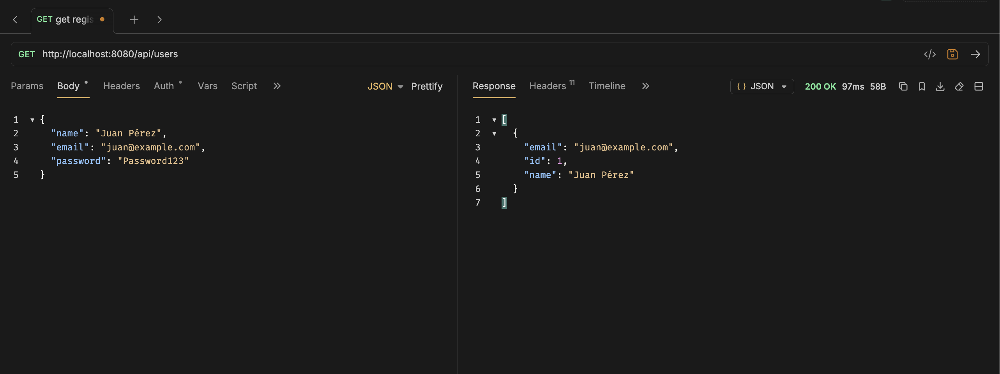

# Programación y Plataformas Web

# **Spring Boot – Autenticación y Autorización con JWT: Seguridad y Control de Acceso**

  
  

## **Práctica 11 (Spring Boot): Autenticación JWT, Autorización por Roles y Protección de Endpoints**

### **Autor**

**Adrian Lazo**

📧 [blazoc@ups.edu.ec](mailto:blazoc@ups.edu.ec)

💻 GitHub: [scomygod](https://github.com/scomygod)

---

# **Evidencias de Consumo de Endpoints**

## **1. Registro de Usuario (POST /auth/register)**
Creación de un nuevo usuario sin requerir token de autenticación.

---

## **2. Login de Usuario (POST /auth/login)**
Autenticación de usuario y generación de token JWT.

---

## **3. Listar Usuarios (GET /api/users)**
Consulta de usuarios sin token, permitida por configuración de seguridad.

